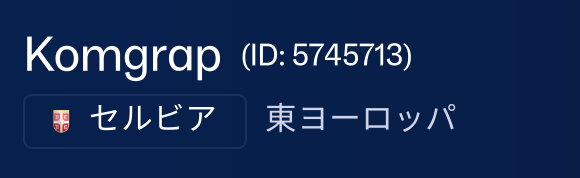

# FMlncGen — .lnc コードジェネレーター

Football Manager のクラブ名・大会名・選手名・スタジアム名を日本語カタカナに自動翻訳し、`.lnc` コードを生成するツールです。
ブラウザだけで動作し、データはあなたの端末から外に出ません（翻訳・画像抽出時のみ AI API を利用）。
翻訳・画像抽出は **Google Gemini** と **Groq** のどちらでも使えます。

## 使い方

1. `index.html`（またはホスト先のURL）をブラウザ（Chrome / Edge 推奨）で開く
2. **APIプロバイダ**（Gemini / Groq）を選び、対応する**APIキー**を入力（無料・後述）
3. **対象**（クラブ名 / 大会名 / 選手名 / スタジアム名）を選ぶ
4. データを貼り付けて「解析して翻訳開始」
5. テーブルで翻訳を確認・修正して「.lncコード生成」→ コピー or 保存

※ データは手入力のほか、**スクリーンショットから抽出**することもできます。FMの画面の画像を読み込ませると、名前とIDを自動で読み取って入力欄に追加します（選択中のプロバイダで処理されます。読み取り精度は Gemini の方が無難です）。

## 生成される .lnc コード

「対象」で選んだ種類に応じて、出力するコードが切り替わります。

**クラブ（対象＝クラブ名）** — LONG / SHORT の2行

| コード | 内容 | 例 |
|---|---|---|
| `CLUB_LONG_NAME_CHANGE` | 日本語カタカナのクラブ名 | `ヴィキングル レイキャヴィーク` |
| `CLUB_SHORT_NAME_CHANGE` | 短縮表示用の名前 | `ヴィキングル` |

**大会（対象＝大会名）** — LONG / SHORT の2行

| コード | 内容 |
|---|---|
| `COMP_LONG_NAME_CHANGE` | 日本語カタカナの大会名 |
| `COMP_SHORT_NAME_CHANGE` | 短縮表示用の名前 |

**選手（対象＝選手名）** — 1行（全言語に適用）

```
"CHANGE_PLAYER_NAME" 45 "" "パオロ マルディーニ"
```

**スタジアム（対象＝スタジアム名）** — 1行

```
"STADIUM_NAME_CHANGE" 102618 "セルティック パーク"
```

クラブ・大会の LONG 名は翻訳結果（＋プレフィックス）がそのまま入ります。
SHORT 名はテーブルの「SHORT名」列で個別に編集でき、**空欄のままにすると LONG と同じ値**で出力されます。順位表や試合画面などで短い名前を使いたいものだけ入力すれば十分です。
選手・スタジアムは SHORT を持たないため、SHORT列は表示されません。

FC / KVK / RES / VV / SV などのフットボール略語・頭字語はプレフィックスとして自動検出され、翻訳されずにそのまま残ります。

## 入力フォーマット

1行につき「名前（＋プレフィックス）＋ 末尾に半角スペース区切りの数値ID」を貼り付けます。

```
KE Wervik 539859
Wanze Bas Oha 132456
```

- 行末の数字がID（クラブ／大会）として認識されます。
- 先頭の連続した大文字略語（FC など）はプレフィックスとして扱われます。

## 国名ヒントで現地読みに寄せる（クラブ名）

クラブ名の翻訳では、**国名を手がかりに、その国の言語の発音へ近づけたカタカナ**にできます（例: セルビアのクラブはセルビア語寄りの読みに）。

一番かんたんなのは、**クラブ名・ID・国名が一緒に表示されている画面のスクリーンショット**を読み込ませる方法です。下のような画面を撮って読み込ませると、国名を自動で読み取り、翻訳のヒントに使います。



- スクショ抽出は `クラブ名 [国名] ID` の形式で書き出します（例: `Komgrap [セルビア] 5745713`）。
- 手入力でも `[国名]` を付ければ同じヒントになります。
- `[国名]` は翻訳のヒントに使うだけで、生成される `.lnc` には含まれません。
- 国名が無い行は、従来どおり綴りから言語圏を推測します。

> 国名が分かっても現地読みが完璧になるわけではありません（AIの推測のため外すこともあります）。気になるものは手で直して辞書に登録すると確実です。

## APIキーの取得（無料）

翻訳・画像抽出には、Gemini か Groq のキーを使います（どちらか、または両方を入力可）。

**Gemini**
1. https://aistudio.google.com を開く
2. 「Get API key」からキーを作成
3. アプリの「Gemini APIキー」欄に貼り付け

**Groq**（高速・無料枠が広め）
1. https://console.groq.com を開く（クレカ不要）
2. API Keys から「Create API Key」でキーを作成（`gsk_...`）
3. **作成直後に1度だけ表示される全文**をコピーし、アプリの「Groq APIキー」欄に貼り付け

※ プロバイダ選択で、翻訳・画像抽出にどちらを使うか切り替えます。
※ キーは各自で取得してください。他人のキーを使うと、その人の無料枠を消費してしまいます。
※ キーはあなたのブラウザの localStorage にのみ保存され、サーバーには送信されません。
※ 画像（スクショ）の読み取り精度は Gemini の方が無難です。

## 辞書ファイル（fm_dictionary.json）

`fm_dictionary.json` は、よく使うクラブ名の訳をまとめた辞書です。

- アプリの「⬆ 辞書をインポート」から読み込むと、これらの語はAIを使わず即座に翻訳されます
- ブラウザのデータをクリアしても、このファイルを再インポートすれば辞書が復活します
- 自分で育てた辞書は「⬇ 辞書をダウンロード」で書き出してバックアップできます

## ファイル構成

| ファイル | 役割 |
|---|---|
| index.html | アプリ本体 |
| manifest.json | アプリ情報（PWA） |
| sw.js | オフライン対応 |
| icon-192.png / icon-512.png | アプリアイコン |
| fm_dictionary.json | 初期辞書（インポート用） |

## アプリとしてインストール（PWA）

Web上（GitHub Pages など）で開くと、ブラウザのアドレスバーに表示される
インストールアイコンから、独立したデスクトップアプリとして導入できます。
一度開けばオフラインでも起動できます（翻訳には通信が必要）。

## 対応言語（UI）

日本語 / English / 简体中文 / 한국어 / Deutsch / Français / Latina / עברית
（翻訳先は日本語カタカナ固定です）

## 注意事項

- 翻訳はAIによる音訳のため、公式表記と異なる場合があります。生成後にテーブルで確認・修正してから適用してください。
- 生成された `.lnc` は、FM の `…/Shared/Database/DB/<バージョン>/LNC/All` フォルダに置いて使います（`<バージョン>` は使用中のFMに対応するフォルダ。実際にDBフォルダ内にある番号を選んでください）。同名の `.lnc` を既に置いている場合は上書きされるので、必要なら事前に控えておいてください。
- 選手名は言語別に分けられない仕様のため、入力した名前が全言語で適用されます。
- スタジアム名は FM のバージョンや対象によっては反映されない場合があります（FM側の仕様）。

## 入力チェック・改行・エラーログ

- 解析時に、末尾の数値IDが取れない行は「読み取れなかった行」として警告表示します（その行はスキップされます）。
- 同じIDが複数行にある場合は「重複ID」として警告します。意図しない上書きを防ぐため、生成前に確認してください。
- `.lnc` の保存・コピー時は、FM標準の **CRLF（`\r\n`）改行**で書き出します（UTF-8・BOMなし）。
- 名前に含まれるダブルクォートなど `.lnc` を壊す文字は、生成時に自動で除去します。
- 動作中にエラーが起きた場合、出力欄の「🐞 エラーログ」ボタンから内容を `.log` ファイルとして保存できます。不具合報告に添付すると原因の特定に役立ちます。

## 便利機能

- **クラブ / 大会 / 選手 / スタジアムの切り替え**: 「対象」で切り替えると、出力コードが `CLUB_…` / `COMP_…` / `CHANGE_PLAYER_NAME` / `STADIUM_NAME_CHANGE` に変わります。いずれも翻訳・スクショ抽出に対応（SHORT名はクラブ・大会のみ）。
- **APIプロバイダ切替**: 翻訳・画像抽出に Gemini / Groq を選べます。Groq は高速・無料枠が広め。画像（スクショ）の読み取り精度は Gemini が無難です。
- **バッチ翻訳**: 複数のクラブ名を1リクエストにまとめて翻訳（JSONで受け取り）し、API呼び出し回数を大幅に削減します。取りこぼした項目は自動で1件ずつ再翻訳します。バッチサイズは 15／20／10／1件 から選べます。
- **辞書だけで翻訳**: AI翻訳が必要な行が無ければ、APIキー無しでも実行できます。キーは「AIに投げる行があるとき」だけ要求されます。
- **重複の自動まとめ**: 同じクラブ名は1回だけ翻訳して使い回すため、API無料枠を節約できます。
- **作業の自動保存・復元**: 解析・翻訳・編集の内容は自動保存され、ブラウザを開き直すと前回の続きから復元できます。新しく始めるときは「クリア」。
- **翻訳・抽出の停止**: 翻訳中・画像抽出中に「停止」ボタンで中断でき（レート制限の待機中でも止まります）、途中までの結果が残ります。
- **全件を辞書に追加**: テーブルの有効な訳をまとめてユーザー辞書に登録できます（次回以降AIを使わず即翻訳）。
- **.lncの読み込み**: 既存の `.lnc`（CLUB / COMP の LONG・SHORT）を読み込んでテーブルに展開し、修正してから再生成できます。読み込んだ内容に応じて対象が自動で切り替わります。
- **要対応のみ表示**: 翻訳が空・失敗の行だけに絞り込んで見直せます。

## 変更履歴

各バージョンの変更点は [Releases](https://github.com/kumajia/FMlncGen/releases) を参照してください。
